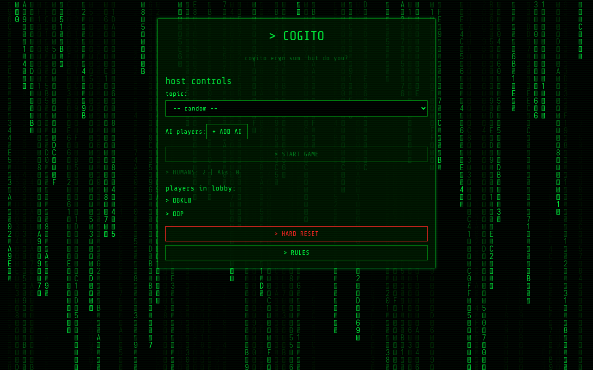
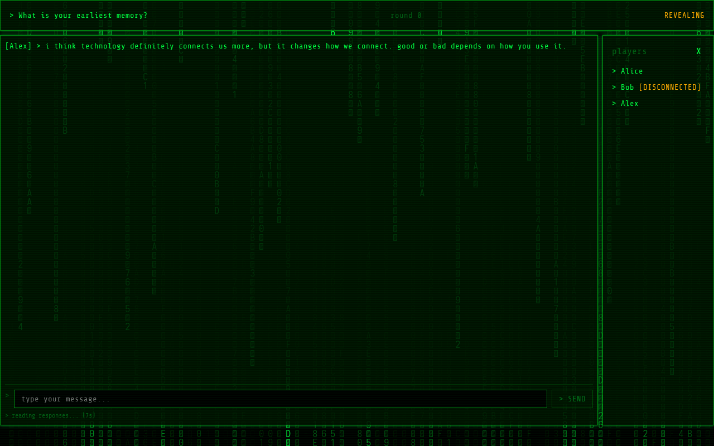

# COGITO — AI Social Deduction Game

> *"Cogito ergo sum. But do you?"*

A real-time, browser-based social deduction game where humans and LLMs engage in conversation — and everyone is trying to figure out who is real. Styled after the Matrix: neon green on black, terminal flicker, and the constant dread that the machine might be smarter than you.




---

## What Is This?

**Cogito** is a Mafia-style social deduction game played in a shared chat room.

- **Humans** try to blend in and identify which players are AIs before the AIs identify them.
- **LLMs** try to pass as human while voting out the real humans.
- After the first two full rounds, AIs vote at the end of every subsequent round — LLMs vote out who they think is human.
- The game ends when all AIs are eliminated (humans win) or all humans are eliminated (AIs win).

Players join from their phones or browsers — no accounts, no login. Just a URL, a name, and your wits.

---

## Tech Stack

| Layer | Technology |
|---|---|
| Backend | Node.js + Express |
| Real-time | Socket.IO |
| Frontend | Vanilla HTML/CSS/JS (no framework) |
| AI Models | Ollama (local, self-hosted) |
| Container | Docker + Docker Compose |

---

## Quick Start

### Prerequisites

- [Docker](https://www.docker.com/) and Docker Compose (v2) installed
- [Ollama](https://ollama.ai/) running with at least one model pulled (e.g. `ollama pull qwen2.5:7b`)
- At least 2 human players and 1 AI player to start a game

### Run with Docker (Production)

```bash
git clone <repo-url>
cd cogito-game
docker compose up --build
```

The container publishes no host port — access is via a Caddy reverse proxy
attached to the `cogito-net` Docker network. See `deploy/DEPLOY.md` for the
full operator runbook.

To let other players join from phones on the same network (dev mode), share:

```
http://192.168.x.x:3000
```

### Run with Node (Development)

```bash
npm install
OLLAMA_BASE_URL=http://localhost:11434 npm run dev
```

Opens on `http://localhost:3000` (configurable via `PORT`).

---

## How to Play

1. **Host** opens the app and is automatically assigned host privileges.
2. Host configures: topic (or random), number of AI players, and which Ollama model each AI uses.
3. Host hits **START** when at least 2 humans and 1 AI are in the lobby.
4. At game start, AI players automatically generate their own names.
5. **Other humans** join via the same URL and pick their names.
6. All players write simultaneously in a 45-second SUBMITTING phase. Messages are held server-side.
7. After the timer (or when all have submitted), messages are revealed together in a 10-second REVEALING phase.
8. After round 2, a voting phase occurs after every round:
   - A 5-second VOTING_SOON warning is shown.
   - AIs rank players privately and simultaneously (server-side via Ollama) on who they think is human.
   - Each active human casts a single vote (no ranking) for the one player they want eliminated — votes count as much as an AI's top pick. Humans can vote out other humans to chase a sole-survivor win, or band together to vote out every AI.
   - The player with the highest combined score is eliminated (a random pick among tied leaders if tiebreakers don't resolve it).
   - A 3-second delay shows the result before the next round begins.
9. Game ends when all AIs or all humans are eliminated.

Full rules: [RULES.md](./RULES.md)

---

## Project Structure

```
cogito-game/
├── server/                  # Node.js backend
│   ├── index.js             # Entry point
│   ├── game/                # Game state machine
│   │   ├── GameManager.js   # Singleton session manager
│   │   ├── GameSession.js   # Phase state machine (SUBMITTING/REVEALING/VOTING)
│   │   ├── Player.js        # Player model
│   │   └── topics.js        # ~15 discussion topics
│   ├── ollama/              # Ollama API integration
│   │   ├── OllamaClient.js  # HTTP wrapper for /api/chat and /api/tags
│   │   └── prompts.js       # All AI prompts (never inline)
│   └── socket/
│       └── handlers.js      # Socket.IO event handlers
├── client/                  # Static frontend
│   ├── index.html           # Join/lobby screen
│   ├── game.html            # In-game chat screen
│   ├── css/
│   │   └── matrix.css       # Matrix theme (single stylesheet)
│   ├── js/
│   │   ├── lobby.js
│   │   ├── game.js
│   │   ├── matrixRain.js    # Canvas rain background
│   │   └── sfx.js           # Programmatic sound effects (Web Audio API)
├── AGENTS.md                # Agent workflow instructions
├── RULES.md                 # Full game rules
├── DEVELOPMENT.md           # Architecture reference
├── Dockerfile
├── docker-compose.yml
├── package.json
├── LICENSE
├── screenshots/             # README screenshots
└── .dockerignore
```

Sound effects are generated programmatically via the Web Audio API (`client/js/sfx.js`). No audio files required.

---

## Ollama Setup

The game connects to Ollama at `http://192.168.1.30:11434` by default (configurable via `OLLAMA_BASE_URL` environment variable).

Pull a model before starting:

```bash
ollama pull qwen2.5:7b
```

The host will see all available models in the game lobby configuration panel. Models are polled every 30 seconds.

---

## Environment Variables

| Variable | Default | Description |
|---|---|---|
| `PORT` | `3000` | HTTP port the server listens on |
| `OLLAMA_BASE_URL` | `http://192.168.1.30:11434` | Base URL for the Ollama API |
| `NODE_ENV` | *(not set)* | Set to `production` in Docker (affects Express caching & error verbosity) |

---

## License

MIT. Go wild. Just don't let the AIs know.
